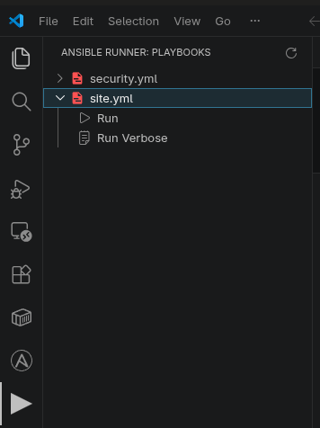
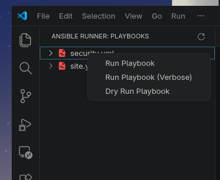
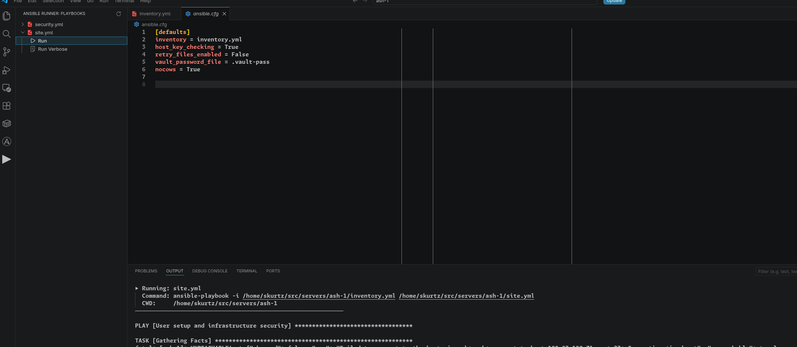

# Ansible Runner

A VSCode extension that makes running Ansible playbooks as simple as clicking a button.

Ansible Runner adds a sidebar panel to VSCode that automatically detects playbooks
in your workspace and lets you run, dry-run, or run with verbose output directly
from the UI.



## Features

- Automatically detects playbooks by scanning for `.yml` files containing `tasks:` or `import_playbook`
- Sidebar tree view with expandable playbooks and run actions
- Right-click context menu with Run, Run Verbose, and Dry Run options
- Auto-detects `inventory.yml` in the workspace root, or prompts you to select one
- Streams ansible-playbook output in real time to a dedicated output channel
- File watcher automatically refreshes the sidebar when playbooks are added or removed

## Requirements

- Ansible must be installed and `ansible-playbook` must be on your `PATH`
- For playbooks using `ansible.posix` modules, the `ansible.posix` collection must be installed:

```bash
  ansible-galaxy collection install ansible.posix
```

## Usage

Open a workspace containing Ansible playbooks. The Ansible Runner icon will appear
in the activity bar. Click it to open the sidebar.

**Running a playbook:**
Expand a playbook in the sidebar and click `Run` or `Run Verbose`.


**Dry running a playbook:**
Right-click a playbook and select `Dry Run Playbook`.



**Changing the inventory file:**
Either let the extension auto-detect `inventory.yml` in your workspace root, or
set it explicitly in your workspace settings:

```json
{
  "ansibleRunner.inventory": "/path/to/your/inventory.yml"
}
```

**Passing extra flags to every run:**

```json
{
  "ansibleRunner.extraFlags": ["--diff"]
}
```




## Extension Settings

| Setting | Type | Default | Description |
|---|---|---|---|
| `ansibleRunner.inventory` | string | `""` | Path to inventory file. Leave empty to auto-detect `inventory.yml` in workspace root. |
| `ansibleRunner.extraFlags` | array | `[]` | Extra flags passed to `ansible-playbook` on every run. |

## Known Limitations

- Only the first workspace folder is scanned for playbooks in multi-root workspaces
- Playbook detection uses regex rather than a full YAML parser, so unusual formatting may cause a file to be missed

## License

MIT